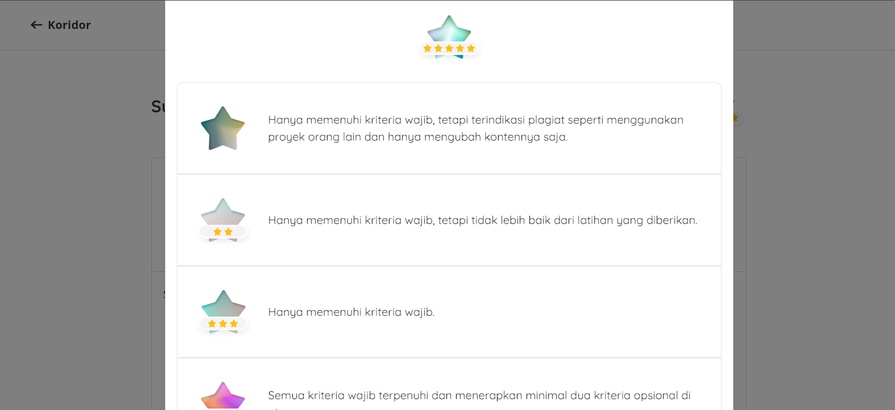
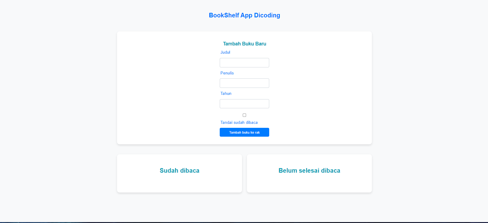

# Membangun Bookshelf App Front-End Web untuk Pemula

Proyek ini merupakan bagian dari kursus "Membangun Bookshelf App Front-End Web untuk Pemula" yang mendapatkan rating 5 bintang di Dicoding. Dalam proyek ini, Anda akan belajar bagaimana membangun aplikasi web front-end sederhana yang memungkinkan pengguna untuk mengelola koleksi buku mereka.

### PERHATIAN!
Proyek ini hanya untuk referensi saja tidak untuk di copy paste. jika ketahuan plagiat dicoding akan mengeluarkan anda, saya tidak akan 
bertanggung jawab bila hal itu terjadi.

## Fitur Aplikasi:
- **Menambah Buku**: Pengguna dapat menambahkan buku baru ke koleksi mereka dengan mengisi formulir yang disediakan.
- **Menghapus Buku**: Pengguna dapat menghapus buku dari koleksi mereka.
- **Mengedit Buku**: Pengguna dapat mengedit informasi buku yang sudah ada di koleksi.
- **Filter Buku**: Pengguna dapat memfilter buku berdasarkan status baca (sudah dibaca atau belum dibaca).

## Teknologi yang Digunakan:
- **HTML**: Struktur dasar aplikasi web.
- **CSS**: Styling untuk tampilan yang menarik dan responsif.
- **JavaScript**: Fungsi interaktif untuk menambah, menghapus, mengedit, dan memfilter buku.

## Tampilan Aplikasi:

*Gambar 1: Rating 5 bintang di Dicoding.*


*Gambar 2: Tampilan hasil akhir aplikasi Bookshelf.*

## Cara Menjalankan Aplikasi
1. Clone repository ini ke komputer Anda.
    ```sh
    git clone https://github.com/DanaGunawan/Membangun-Bookshelf-App-Front-End-Web-untuk-Pemula.git
    ```
2. Buka file `index.html` di browser untuk melihat tampilan aplikasi.

## Kontribusi
Jika Anda ingin berkontribusi pada proyek ini, silakan buat pull request atau laporkan masalah melalui [issue tracker](https://github.com/DanaGunawan/Membangun-Bookshelf-App-Front-End-Web-untuk-Pemula/issues).

## Lisensi
Proyek ini dilisensikan di bawah [MIT License](LICENSE).

## Kontak
Jika Anda memiliki pertanyaan atau saran, silakan hubungi saya melalui [email](mailto:dana@example.com).

---

Selamat belajar dan semoga proyek ini bermanfaat!
